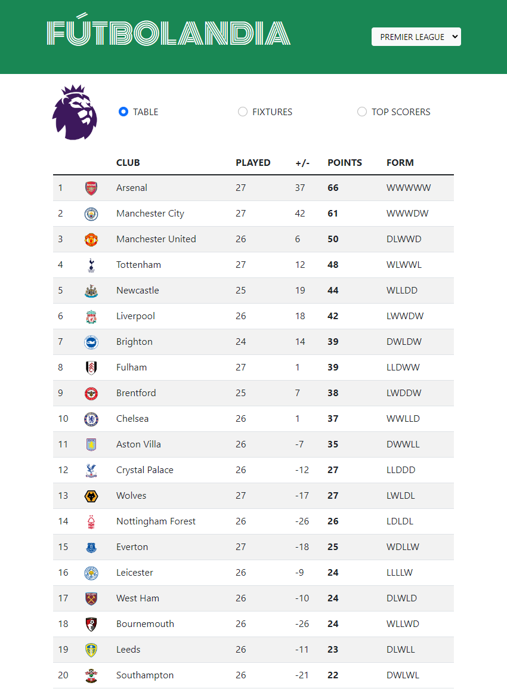

# FÚTBOLANDIA
  

  # Description 
  Your home for tables, fixtures, and top scorers from football's biggest leagues!
  # Table of Contents 
  * [Link](#link)
  * [Usage](#usage)
  * [License](#license)
  * [Contributing](#contributing)
  * [Questions](#questions)
  # Link 
  [Link to deployed website](https://williamgeorgethomas.github.io/futbolandia/)
  # Usage 
  Use the dropdown menu to select a league.  Then use the radio buttons to view the league table, upcoming fixutres, or top scorers.
   # License
This application is covered under the MIT license
  # Contributing 
  William G. Thomas
  # Questions 
  For further information:
 
  * GitHub:
    * [https://github.com/WilliamGeorgeThomas](https://github.com/WilliamGeorgeThomas)
 
  * Email:
    * williamgeorgethomas@gmail.com

# Screenshot

